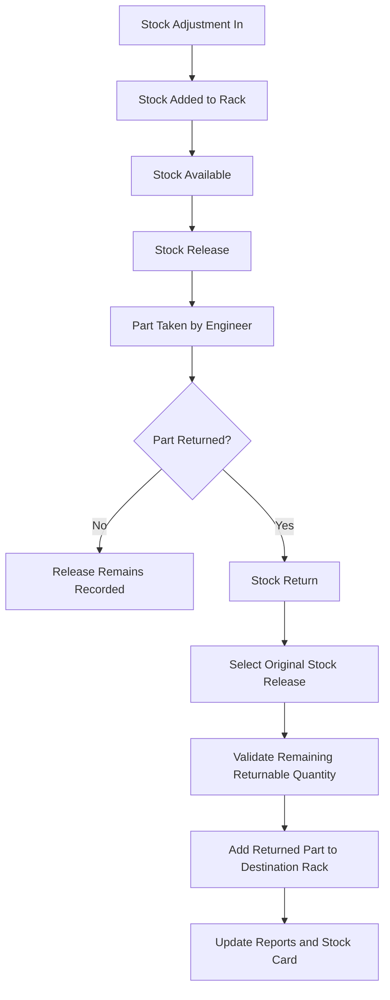

# Mini Inventory Management System
## Functional Specification Document (FSD)

**Document Version:** 1.0  
**Reference:** Mini Inventory Management System BRD  

---

# 1. Purpose

This document defines the functional behavior of the Stock Adjustment In, Stock Release, Stock Return, and reporting processes.

The specification is intended to be used as an implementation reference for developers and Codex.

---

# 2. General Conventions

## 2.1 Transaction Status

All transaction modules use the following statuses:

| Status | Definition | Stock Effect |
|---|---|---|
| Draft | Transaction is saved but not posted | No stock effect |
| Completed | Transaction passes validation and is posted | Updates stock |
| Cancelled | Transaction is invalidated | No current stock effect |

## 2.2 Common Transaction Rules

| ID | Rule |
|---|---|
| FSD-GEN-001 | Transaction numbers shall be generated automatically. |
| FSD-GEN-002 | Transaction numbers shall be unique. |
| FSD-GEN-003 | Quantity must be greater than zero. |
| FSD-GEN-004 | Only active master records may be selected. |
| FSD-GEN-005 | Draft transactions shall not affect stock. |
| FSD-GEN-006 | Completed transactions shall update stock immediately. |
| FSD-GEN-007 | Cancelled transactions shall not affect current stock. |
| FSD-GEN-008 | Completed transactions shall not be permanently deleted. |
| FSD-GEN-009 | The system shall record Created By and Created Date. |
| FSD-GEN-010 | Stock shall be maintained by Device Detail and Rack. |

---

# 3. Stock Adjustment In

## 3.1 Functional ID

`TRX-SAI`

## 3.2 Purpose

Records parts entering inventory through initial stock, new receipt, additional stock, or stock correction.

## 3.3 Preconditions

- User is authenticated.
- Device exists and is active.
- Device Detail exists and is active.
- Destination Rack exists and is active.

## 3.4 Input Fields

### Header

| Field | Type | Required | Behavior |
|---|---|---:|---|
| Stock-In Number | Text | System | Generated on creation |
| Transaction Date | Date | Yes | Defaults to current date |
| Customer | Lookup | No | Shows active Customers |
| Notes | Textarea | No | Free text |
| Status | Enum | System | Defaults to Draft |
| Created By | User | System | Logged-in user |
| Created Date | Datetime | System | Creation timestamp |

### Detail

| Field | Type | Required | Behavior |
|---|---|---:|---|
| Device | Lookup | Yes | Shows active Devices |
| Device Detail | Lookup | Yes | Filtered by selected Device |
| Part Number | Display | System | Taken from Device Detail |
| DP/N | Display | System | Taken from Device Detail |
| Specification | Display | System | Taken from Device Detail |
| Destination Rack | Lookup | Yes | Shows active Racks |
| Quantity | Number | Yes | Integer greater than zero |
| Notes | Text | No | Detail notes |

## 3.5 Main Flow

1. User opens **Transaction > Stock Adjustment In**.
2. User selects **Create**.
3. System generates a Stock-In Number.
4. System sets Status to `Draft`.
5. User enters Transaction Date.
6. User optionally selects Customer.
7. User selects Device.
8. System filters Device Details by selected Device.
9. User selects Device Detail.
10. System displays Part Number, DP/N, and Specification.
11. User selects Destination Rack.
12. User enters Quantity.
13. User optionally enters Notes.
14. User selects **Complete**.
15. System validates all required fields.
16. System validates Quantity greater than zero.
17. System changes Status to `Completed`.
18. System adds Quantity to stock for the selected Device Detail and Rack.
19. System creates a Stock Card movement with Quantity In.
20. System makes the transaction available in Stock-In reports.

## 3.6 Alternative Flows

### AF-SAI-001: Invalid Quantity

1. Quantity is zero or negative.
2. System blocks completion.
3. System displays: `Quantity must be greater than zero.`

### AF-SAI-002: Inactive Master Data

1. A Device Detail or Rack is inactive.
2. System does not show the record in the lookup.

### AF-SAI-003: Cancellation

1. User selects an eligible transaction.
2. User selects **Cancel**.
3. System sets Status to `Cancelled`.
4. If the transaction was previously Completed, the system reverses its stock impact.
5. System retains the transaction history.

## 3.7 Stock Logic

```text
New Stock =
Previous Stock + Stock Adjustment In Quantity
```

## 3.8 Postconditions

- Stock is increased.
- Stock Card is updated.
- Stock-In Report is updated.
- Stock-In Report by Customer is updated when Customer is populated.

## 3.9 Acceptance Criteria

```gherkin
Feature: Stock Adjustment In

  Scenario: Complete a valid stock-in transaction
    Given the user is authenticated
    And an active Device Detail exists
    And an active Rack exists
    When the user enters a Quantity greater than zero
    And completes the transaction
    Then the system shall set the status to "Completed"
    And increase stock for the selected Device Detail and Rack
    And create a Quantity In movement in the Stock Card

  Scenario: Reject zero quantity
    When the user enters Quantity equal to zero
    And attempts to complete the transaction
    Then the system shall reject the transaction
    And display "Quantity must be greater than zero."
```

---

# 4. Stock Release

## 4.1 Functional ID

`TRX-SRL`

## 4.2 Purpose

Records parts taken from a rack by an engineer for customer support.

## 4.3 Preconditions

- User is authenticated.
- Engineer Name is available for entry.
- Customer exists and is active.
- Device Detail exists and is active.
- Source Rack exists and is active.
- Sufficient stock is available.

## 4.4 Input Fields

### Header

| Field | Type | Required | Behavior |
|---|---|---:|---|
| Stock Release Number | Text | System | Generated on creation |
| Release Date | Date | Yes | Defaults to current date |
| Engineer Name | Text/Lookup | Yes | Engineer taking the part |
| Customer | Lookup | Yes | Shows active Customers |
| Model | Lookup | No | Shows active Models |
| Service Tag | Lookup | No | Filtered by Model and Customer |
| Support Ticket / Reference | Text | No | Support reference |
| Notes | Textarea | No | Free text |
| Status | Enum | System | Defaults to Draft |
| Created By | User | System | Logged-in user |
| Created Date | Datetime | System | Creation timestamp |

### Detail

| Field | Type | Required | Behavior |
|---|---|---:|---|
| Device | Lookup | Yes | Shows active Devices |
| Device Detail | Lookup | Yes | Filtered by selected Device |
| Part Number | Display | System | Taken from Device Detail |
| DP/N | Display | System | Taken from Device Detail |
| Specification | Display | System | Taken from Device Detail |
| Source Rack | Lookup | Yes | Shows racks containing the selected part |
| Available Quantity | Display | System | Current stock in Source Rack |
| Released Quantity | Number | Yes | Integer greater than zero |
| Notes | Text | No | Detail notes |

## 4.5 Main Flow

1. User opens **Transaction > Stock Release**.
2. User selects **Create**.
3. System generates a Stock Release Number.
4. System sets Status to `Draft`.
5. User enters Release Date.
6. User enters or selects Engineer Name.
7. User selects Customer.
8. User optionally selects Model.
9. System filters Service Tags by selected Model and Customer.
10. User optionally selects Service Tag.
11. User optionally enters Support Ticket / Reference.
12. User selects Device.
13. System filters Device Details by selected Device.
14. User selects Device Detail.
15. System displays Part Number, DP/N, and Specification.
16. System displays Racks containing stock for the selected Device Detail.
17. User selects Source Rack.
18. System displays Available Quantity.
19. User enters Released Quantity.
20. User selects **Complete**.
21. System validates mandatory fields.
22. System rechecks current stock.
23. System validates Released Quantity does not exceed Available Quantity.
24. System changes Status to `Completed`.
25. System subtracts Released Quantity from the selected Device Detail and Rack.
26. System creates a Stock Card movement with Quantity Out.
27. System makes the transaction available in Stock-Out reports.
28. System allows the transaction to be referenced by Stock Return.

## 4.6 Alternative Flows

### AF-SRL-001: Insufficient Stock

1. Released Quantity exceeds Available Quantity.
2. System blocks completion.
3. System displays: `Released quantity cannot exceed available stock.`
4. System displays the current Available Quantity.

### AF-SRL-002: Missing Engineer

1. Engineer Name is empty.
2. System blocks completion.
3. System displays: `Engineer Name is required.`

### AF-SRL-003: Missing Customer

1. Customer is empty.
2. System blocks completion.
3. System displays: `Customer is required.`

### AF-SRL-004: Service Tag Not Applicable

1. Release is not linked to a specific asset.
2. User leaves Service Tag empty.
3. System allows the transaction to continue.

### AF-SRL-005: Multiple Racks

1. Device Detail has stock in more than one Rack.
2. System displays each Rack and Available Quantity.
3. User selects one Source Rack.

### AF-SRL-006: Cancellation

1. User selects an eligible transaction.
2. User selects **Cancel**.
3. System sets Status to `Cancelled`.
4. If previously Completed, the system restores stock to the original Source Rack.
5. System retains the transaction history.

## 4.7 Stock Logic

```text
New Stock =
Previous Stock - Released Quantity
```

## 4.8 Postconditions

- Stock is reduced.
- Stock cannot become negative.
- Engineer and Customer are recorded.
- Stock Card is updated.
- Stock-Out reports are updated.
- Transaction becomes eligible for Stock Return.

## 4.9 Acceptance Criteria

```gherkin
Feature: Stock Release

  Scenario: Complete a valid stock release
    Given sufficient stock is available
    When the user enters an Engineer Name
    And selects a Customer
    And selects a Device Detail and Source Rack
    And enters a valid Released Quantity
    And completes the transaction
    Then the system shall set the status to "Completed"
    And reduce stock from the selected Rack
    And create a Quantity Out movement in the Stock Card

  Scenario: Prevent negative stock
    Given Available Quantity is 2
    When the user enters Released Quantity as 3
    And attempts to complete the transaction
    Then the system shall reject the transaction
    And stock shall remain unchanged
```

---

# 5. Stock Return

## 5.1 Functional ID

`TRX-SRT`

## 5.2 Purpose

Records parts returned after a completed Stock Release.

## 5.3 Preconditions

- User is authenticated.
- A Completed Stock Release exists.
- At least one released detail has Remaining Returnable Quantity greater than zero.
- Destination Rack exists and is active.

## 5.4 Input Fields

### Header

| Field | Type | Required | Behavior |
|---|---|---:|---|
| Stock Return Number | Text | System | Generated on creation |
| Return Date | Date | Yes | Defaults to current date |
| Original Stock Release Number | Lookup | Yes | Shows eligible Completed releases |
| Engineer Name | Display | System | Taken from release |
| Customer | Display | System | Taken from release |
| Notes | Textarea | No | Free text |
| Status | Enum | System | Defaults to Draft |
| Created By | User | System | Logged-in user |
| Created Date | Datetime | System | Creation timestamp |

### Detail

| Field | Type | Required | Behavior |
|---|---|---:|---|
| Device | Display | System | Taken from release |
| Device Detail | Display | System | Taken from release |
| Part Number | Display | System | Taken from Device Detail |
| DP/N | Display | System | Taken from Device Detail |
| Specification | Display | System | Taken from Device Detail |
| Released Quantity | Display | System | Original released quantity |
| Previously Returned Quantity | Display | System | Sum of prior Completed returns |
| Remaining Returnable Quantity | Display | System | Released minus prior returns |
| Return Quantity | Number | Yes | Greater than zero and within remaining quantity |
| Destination Rack | Lookup | Yes | Shows active Racks |
| Notes | Text | No | Detail notes |

## 5.5 Main Flow

1. User opens **Transaction > Stock Return**.
2. User selects **Create**.
3. System generates a Stock Return Number.
4. System sets Status to `Draft`.
5. User enters Return Date.
6. User searches for Original Stock Release Number.
7. System displays only Completed Stock Releases with remaining returnable quantity.
8. User selects the original Stock Release.
9. System displays Engineer Name and Customer.
10. System displays released details.
11. System calculates Previously Returned Quantity.
12. System calculates Remaining Returnable Quantity.
13. User selects the part to return.
14. User enters Return Quantity.
15. User selects Destination Rack.
16. User optionally enters Notes.
17. User selects **Complete**.
18. System validates Return Quantity.
19. System validates Return Quantity does not exceed Remaining Returnable Quantity.
20. System changes Status to `Completed`.
21. System adds Return Quantity to the selected Device Detail and Destination Rack.
22. System updates Remaining Returnable Quantity.
23. System creates a Stock Card movement with Quantity In.
24. System makes the transaction available in Stock-In reports.

## 5.6 Alternative Flows

### AF-SRT-001: Partial Return

1. Released Quantity is 5.
2. Previously Returned Quantity is 0.
3. User returns 2.
4. System increases stock by 2.
5. System sets Remaining Returnable Quantity to 3.

### AF-SRT-002: Excessive Return

1. Remaining Returnable Quantity is 2.
2. User enters Return Quantity as 3.
3. System blocks completion.
4. System displays: `Return quantity cannot exceed remaining returnable quantity.`

### AF-SRT-003: Fully Returned Detail

1. Remaining Returnable Quantity is zero.
2. System does not allow the detail to be selected for another return.

### AF-SRT-004: Different Destination Rack

1. Original Source Rack is Rack A.
2. User selects Rack B as Destination Rack.
3. System adds the returned stock to Rack B.

### AF-SRT-005: Cancellation

1. User selects an eligible Stock Return.
2. User selects **Cancel**.
3. System sets Status to `Cancelled`.
4. If previously Completed, the system removes the returned quantity from the Destination Rack.
5. System restores the Remaining Returnable Quantity.
6. System retains the transaction history.

## 5.7 Stock Logic

```text
New Stock =
Previous Stock + Return Quantity
```

```text
Remaining Returnable Quantity =
Released Quantity - Total Completed Return Quantity
```

## 5.8 Postconditions

- Stock is increased in Destination Rack.
- Original Stock Release remains traceable.
- Remaining Returnable Quantity is updated.
- Stock Card is updated.
- Stock-In reports are updated.

## 5.9 Acceptance Criteria

```gherkin
Feature: Stock Return

  Scenario: Complete a valid stock return
    Given a Completed Stock Release has a Remaining Returnable Quantity greater than zero
    When the user enters a valid Return Quantity
    And selects a Destination Rack
    And completes the transaction
    Then the system shall set the status to "Completed"
    And increase stock in the Destination Rack
    And reduce the Remaining Returnable Quantity
    And create a Quantity In movement in the Stock Card

  Scenario: Prevent return above remaining quantity
    Given Remaining Returnable Quantity is 2
    When the user enters Return Quantity as 3
    Then the system shall reject the transaction
    And stock shall remain unchanged
```

---

# 6. End-to-End Flow



---

# 7. Report Specifications

## 7.1 Stock Card Report

### Functional ID

`RPT-SC`

### Data Source

- Completed Stock Adjustment In.
- Completed Stock Release.
- Completed Stock Return.

### Mapping

| Transaction | Quantity In | Quantity Out |
|---|---:|---:|
| Stock Adjustment In | Transaction Quantity | 0 |
| Stock Release | 0 | Released Quantity |
| Stock Return | Return Quantity | 0 |

### Running Balance

```text
Running Balance =
Previous Running Balance + Quantity In - Quantity Out
```

### Sort Order

1. Transaction Date ascending.
2. Created Date ascending.
3. Transaction Number ascending.

### Filters

- Date Range.
- Device.
- Device Detail.
- Part Number.
- DP/N.
- Rack.
- Transaction Type.

---

## 7.2 Stock Card Report by Customer

### Functional ID

`RPT-SC-CUST`

### Behavior

- Uses the same movement logic as Stock Card Report.
- Only includes transactions associated with the selected Customer.
- Transactions without Customer are excluded.

### Filters

- Date Range.
- Customer.
- Model.
- Service Tag.
- Device.
- Device Detail.
- Transaction Type.

---

## 7.3 Stock-In Report

### Functional ID

`RPT-IN`

### Included Transactions

- Completed Stock Adjustment In.
- Completed Stock Return.

### Stock-In Type

| Transaction | Stock-In Type |
|---|---|
| Stock Adjustment In | Adjustment In |
| Stock Return | Return |

### Filters

- Date Range.
- Device.
- Device Detail.
- Part Number.
- DP/N.
- Rack.
- Stock-In Type.

---

## 7.4 Stock-In Report by Customer

### Functional ID

`RPT-IN-CUST`

### Behavior

- Uses the same source as Stock-In Report.
- Filters records by selected Customer.
- Excludes records without Customer.

---

## 7.5 Stock-Out Report

### Functional ID

`RPT-OUT`

### Included Transactions

- Completed Stock Release.

### Filters

- Date Range.
- Engineer Name.
- Customer.
- Model.
- Service Tag.
- Device.
- Device Detail.
- Source Rack.

---

## 7.6 Stock-Out Report by Customer

### Functional ID

`RPT-OUT-CUST`

### Behavior

- Uses the same source as Stock-Out Report.
- Filters records by selected Customer.

---

# 8. Suggested Data Entities

This section is a logical reference and does not prescribe a specific framework or database.

## 8.1 Master Entities

- `models`
- `service_tags`
- `devices`
- `device_details`
- `customers`
- `racks`

## 8.2 Transaction Entities

- `stock_adjustment_ins`
- `stock_adjustment_in_details`
- `stock_releases`
- `stock_release_details`
- `stock_returns`
- `stock_return_details`

## 8.3 Suggested Stock Ledger Entity

A stock ledger is recommended as the source of truth for reports and balances.

Entity: `stock_movements`

Suggested fields:

| Field | Description |
|---|---|
| id | Unique identifier |
| transaction_type | SAI, SRL, or SRT |
| transaction_id | Source transaction ID |
| transaction_detail_id | Source detail ID |
| transaction_number | Human-readable number |
| transaction_date | Business transaction date |
| device_detail_id | Related Device Detail |
| rack_id | Related Rack |
| customer_id | Nullable Customer |
| engineer_name | Nullable Engineer |
| quantity_in | Incoming quantity |
| quantity_out | Outgoing quantity |
| created_by | User ID |
| created_at | Timestamp |

### Ledger Rules

- A Completed Stock Adjustment In creates one or more Quantity In movements.
- A Completed Stock Release creates one or more Quantity Out movements.
- A Completed Stock Return creates one or more Quantity In movements.
- Stock balance is the sum of Quantity In minus Quantity Out.
- Cancellation must reverse or exclude the original movement consistently.

---

# 9. Validation Message Reference

| Code | Message |
|---|---|
| VAL-001 | Quantity must be greater than zero. |
| VAL-002 | Engineer Name is required. |
| VAL-003 | Customer is required. |
| VAL-004 | Released quantity cannot exceed available stock. |
| VAL-005 | Return quantity cannot exceed remaining returnable quantity. |
| VAL-006 | Device Detail is required. |
| VAL-007 | Rack is required. |
| VAL-008 | Original Stock Release is required. |
| VAL-009 | Selected master data is inactive. |
| VAL-010 | Duplicate record already exists. |

---

# 10. Recommended Implementation Order

1. Authentication.
2. Master data.
3. Stock Movement ledger.
4. Stock Adjustment In.
5. Stock balance query.
6. Stock Release.
7. Stock Return.
8. Stock Card Report.
9. Stock-In reports.
10. Stock-Out reports.
11. Excel export.
